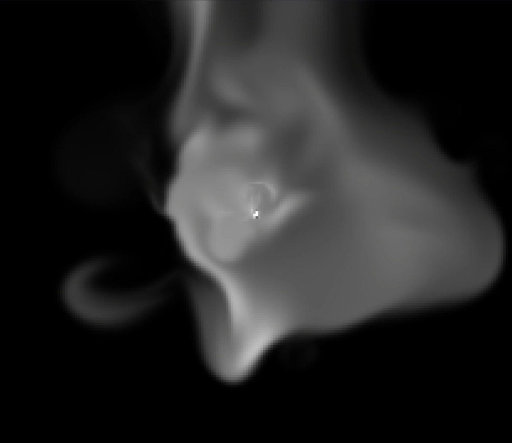
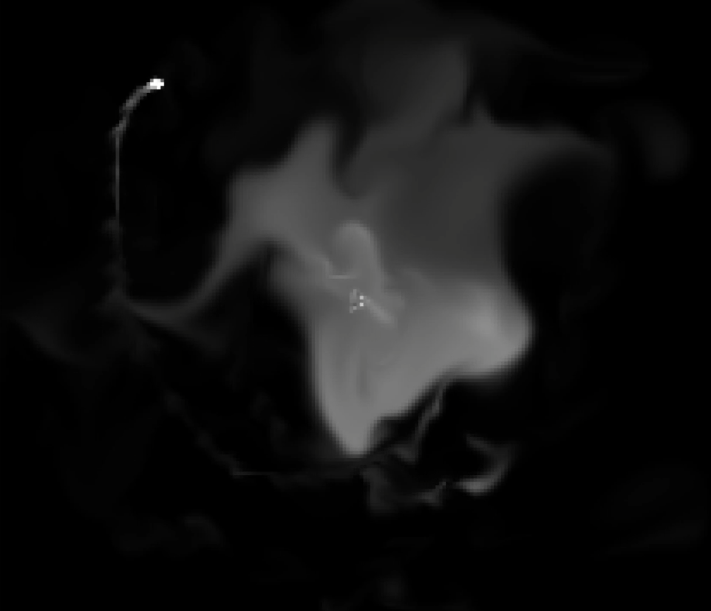
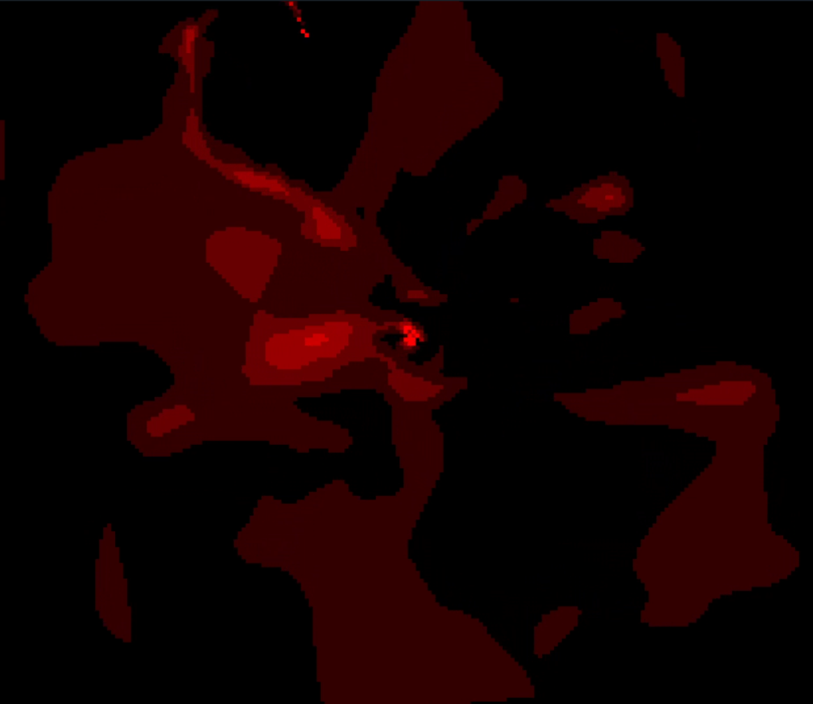
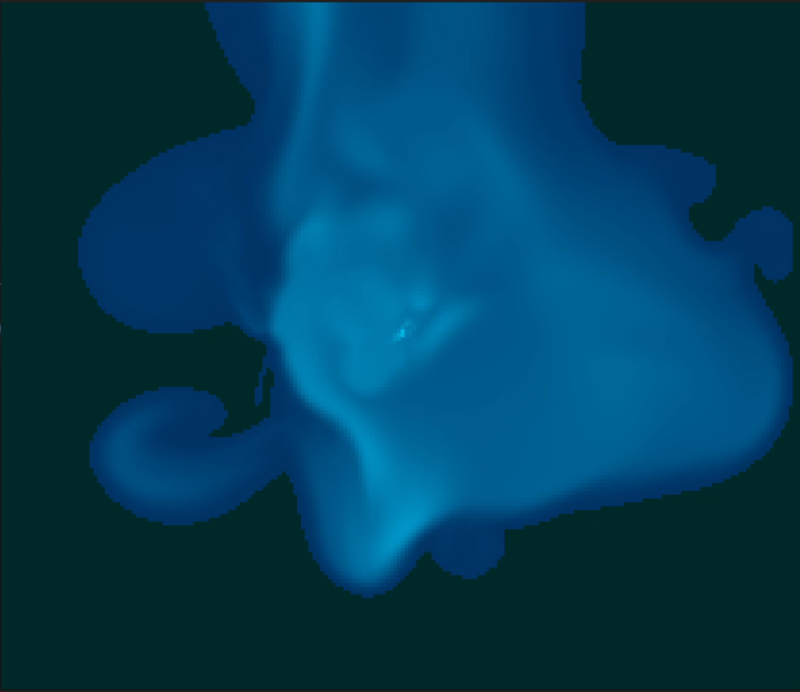

<div align="center">
    
    <br/>
    <b>2D Fluid Simulation using SDL and C</b>
    <br/>
    <br/>
    
    
    
</div>


# 2D Fluid simulation

I built with the C programming language and the amazing SDL library, a two-dimensional incompressible fluid simulation. I used this [tutorial](https://mikeash.com/pyblog/fluid-simulation-for-dummies.html), and adapted the visualization to SDL.

I simulated only density and velocity, but I could've added temperature.

The simulation consists in three arrays : `Vx, Vy and density`. These arrays represents respectiveley the x velocity, the y velocity and the density at a given point. 
At each step, it calculates the next density and velocity, using physics laws.

# Usage


**Use the `s` key to switch mode**

There are three visualization modes : 

1. **Density** : the whiter the cell, the denser it is.
   


2. **Velocity** : the reder the cell, the faster it is.
   


3. **Density** and **Velocity** : the bluer the cell, the more the mean of density and velocity is high.
   



---

# Compilation

## Linux

You first have to install the SDL2 library :

```
sudo apt-get install libsdl2-dev
```
And then just have to compile the program using make : 
```
make
```
or if you somehow haven't `make` installed on your OS, run the compilation line :
```
gcc main.c -o ./bin/prog src/*.c -lSDL2 -lm
```
and eventually, run the program using :
```
./bin/prog
```

## Windows

Compilation for windows is not available yet.